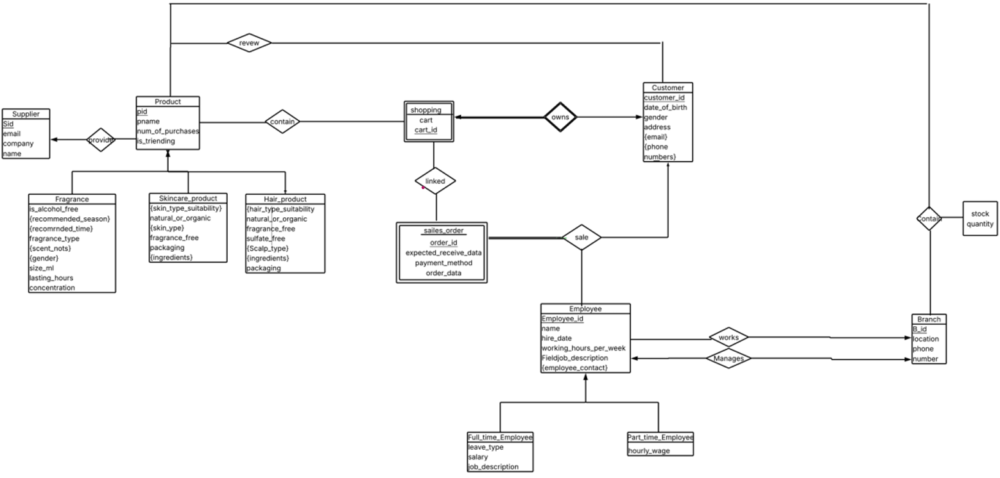

# Cosmetics Store Web Application

## Project Overview
This is a full-stack web application for an online cosmetics store built using **Flask (Python)** and **MySQL**.  
The system supports customers, managers, product browsing, cart management, ordering, and administrative analytics.

---

## Features

### Customer Features
- User registration and login
- Browse products by category:
  - Skincare
  - Haircare
  - Fragrance
- Filter products by:
  - Price
  - Trending products
  - Best-selling products
  - Product-specific attributes (e.g. skin type, hair type, fragrance notes)
- Product details page
- Shopping cart:
  - Add / update / remove products
- Checkout system:
  - Select branch
  - Choose employee
  - Add address
  - Choose payment method
- Order confirmation page

### Manager Features
- Dashboard for managing:
  - Customers
  - Employees
  - Products
  - Orders
  - Branches
  - Suppliers
- Product analytics:
  - Trending products
  - Highest rated products
  - Most reviewed products
  - Least selling products
- Customer analytics:
  - Top customers by spending
  - Spending by gender and age group
- Employee performance tracking
- Branch inventory tracking (stock status)

---

## Tech Stack
- Backend: Flask (Python)
- Frontend: HTML, CSS, Jinja2 templates
- Database: MySQL
- Libraries:
  - flask
  - mysql-connector-python
  - datetime
  - functools
  - decimal

---

## Database

Database name:
cosmetics_store_db
## Entity Relationship Diagram (ERD)

Main tables:
- Product
- Customer
- Employee
- Shopping_Cart
- Cart_Product
- Sales_Order
- Order_Line
- Payment
- Branch
- Supplier
- Reviews
- Category-specific tables (Skincare, Haircare, Fragrance)

---

## How to Run the Project

### 1. Install requirements
pip install flask mysql-connector-python

### 2. Set up MySQL database
CREATE DATABASE cosmetics_store_db;

Import your schema and data into MySQL.

### 3. Update database credentials in app.py
host = "127.0.0.1"
user = "root"
password = "your_password"
database = "cosmetics_store_db"

### 4. Run the application
python app.py

### 5. Open in browser
http://127.0.0.1:5000/

---

## Future Improvements
- Add password hashing (bcrypt)
- Improve UI with React or Bootstrap
- Add REST API layer
- Add payment gateway integration
- Improve role-based access control

---

## Author
Maisam AbuJaber
Raghad Qadus
Cosmetics Store Project - DataBase Course
